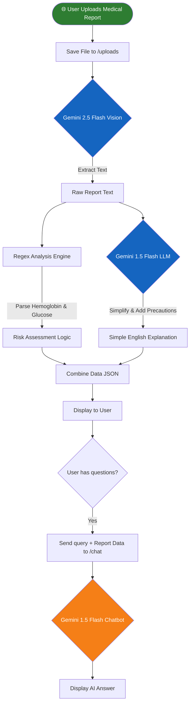

<div align="center">

# 🩺 MedExplain

### *AI-Powered Medical Report Analysis & Patient Assistance System*

[](https://www.python.org/)
[](https://flask.palletsprojects.com/)
[](https://aistudio.google.com/)
[](#)
[](LICENSE)
[](CONTRIBUTING.md)

> 🚀 **An intelligent, real-world medical tech solution** designed to demystify complex medical reports. By leveraging advanced Google Gemini AI models, MedExplain bridges the gap between complicated clinical data and everyday patient understanding, acting as a virtual medical assistant that extracts, analyzes, and explains medical test results in simple language.

</div>

---

## 📋 Table of Contents

- [📌 Problem Statement](#-problem-statement)
- [💡 Solution & Approach](#-solution--approach)
- [🎯 Objectives](#-objectives)
- [🛠️ Technology Stack](#️-technology-stack)
- [📁 Project Structure](#-project-structure)
- [🔬 How It Works — System Flowchart](#-how-it-works--system-flowchart)
- [💻 Code Analysis](#-code-analysis)
- [📦 Dependencies](#-dependencies)
- [🚀 Installation & Setup](#-installation--setup)
- [🎬 System Demo](#-system-demo)
- [🌍 Impact & Real-World Significance](#-impact--real-world-significance)
- [🔮 Future Enhancements](#-future-enhancements)
- [🤝 Open Source Contribution](#-open-source-contribution)
- [📄 License](#-license)
- [👨‍💻 Author & Acknowledgments](#-author--acknowledgments)

---

## 📌 Problem Statement

> **"Patients often receive medical lab reports filled with complex terminology, leading to confusion, anxiety, and a heavy reliance on doctors for basic interpretation."**

### Background

**HackHustle 2.0 (Saveetha Engineering College)** Problem Statement: *Medical related advanced project using AI.*

Medical reports traditionally come with raw data, numerical values, and clinical jargon. This approach leads to:
- Patient anxiety due to misinterpretation of data.
- Unnecessary clinical visits for basic report clarifications.
- Inability of patients to quickly assess their immediate health risks (like abnormal Glucose or Hemoglobin).

### The Core Problem

| Challenge | Description |
|-----------|-------------|
| 🔴 **Complex Terminology** | Medical jargon is unreadable for the average person. |
| 🔴 **Delayed Understanding** | Patients wait hours or days for a doctor to explain basic results. |
| 🔴 **Risk Ignorance** | Critical high/low values often go unnoticed by the patient until consultation. |
| 🔴 **Lack of Follow-up Support** | Patients leave the clinic with questions but no immediate way to ask them. |

---

## 💡 Solution & Approach

### Our Strategy

We engineered a streamlined, AI-driven web application to instantly process medical documents and provide conversational support:

1. **Intelligent OCR Extraction** — Extracts critical medical values (like Hemoglobin and Glucose) accurately from image-based reports using the Gemini 2.5 Flash vision model.
2. **Automated Risk Analysis** — Rule-based backend logic determines if extracted values fall under "Normal", "High", or "Low" thresholds, assigning an overall health risk level.
3. **AI-Powered Simplification** — Transforms the clinical data into a "Simple English" explanation using Gemini 1.5 Flash, along with actionable precaution suggestions.
4. **Interactive Medical Chatbot** — An integrated conversational AI contextually aware of the patient's specific report, ready to answer follow-up questions seamlessly.

### Architecture Overview

```text
[Patient (User)]
        ↓  Uploads Medical Report (Image/PDF)
[Frontend Interface (HTML/JS/CSS)]
        ↓  HTTP POST Request /analyze
[Flask Backend API]
        ├── OCR Module (Gemini 2.5 Flash Vision)
        ├── Rule-based Analysis Engine (Regex & Logic)
        └── Explanation Generator (Gemini 1.5 Flash)
        ↓  JSON Response
[Frontend Interface (Displays Data & Explanation)]
        ↓  Follow-up Questions
[Interactive Chatbot Module (/chat)]
```

---

## 🎯 Objectives

- ✅ **Instant Text Extraction** using cutting-edge multimodal AI models.
- ✅ **Automated Value Parsing** for critical health indicators like Glucose and Hemoglobin.
- ✅ **Democratize Health Data** by translating medical jargon into simple, actionable language.
- ✅ **Provide Real-time Q&A** via an intelligent conversational assistant contextually bound to the user's report.
- ✅ **Build an Open-Source Foundation** for further medical AI integration by the developer community.

---

## 🛠️ Technology Stack

### Backend & AI

| Component | Specification | Role |
|-----------|--------------|------|
| **Framework** | Flask | Lightweight Python web framework |
| **Language** | Python 3 | Primary programming language |
| **Vision AI** | Gemini 2.5 Flash | OCR and multimodal image extraction |
| **LLM AI** | Gemini 1.5 Flash | Natural language explanations and chatbot logic |
| **File Handling** | OS / Werkzeug | Secure local file uploads and management |

### Frontend

| Technology | Role |
|--------------------|---------|
| **HTML5/CSS3** | Structure and responsive styling |
| **JavaScript/ES6** | Asynchronous API calls and dynamic UI updates |
| **Jinja2 (Templates)**| Server-side rendering with Flask |

---

## 📦 Dependencies

### Core Python Packages

Defined in `requirements.txt`:

```text
flask                 # Core web framework
pytesseract           # Optical Character Recognition (Legacy support/Alternative)
pillow                # Image processing library
google-generativeai   # Google Gemini API integration
```

---

## 📁 Project Structure

```text
MedExplain/
│
├── 📁 templates/                 # Frontend HTML Views
│   └── 📄 index.html             # Main Dashboard & Chat Interface
│
├── 📁 uploads/                   # Temporary directory for uploaded reports
│
├── 📄 app.py                     # ⭐ Flask App & Core Business Logic
├── 📄 requirements.txt           # Python dependencies
└── 📄 README.md                  # Documentation
```

---

## 🔬 How It Works — System Flowchart



### Step-by-Step Operation

| Step | Action | Description |
|------|--------|-------------|
| 1 | **Upload** | User uploads a photo or document of their blood test or lab report. |
| 2 | **Extraction** | System securely passes the image to Gemini Vision API to extract numerical values. |
| 3 | **Analysis** | Regex captures explicit values. If Glucose > 140, it flags "High Risk". |
| 4 | **Explanation** | The AI writes a friendly, jargon-free summary and suggests precautions. |
| 5 | **Interaction** | User chats with the bot: "What foods should I avoid with high glucose?" |

---

## 💻 Code Analysis

### Main Architecture Decisions

#### AI Integration (`app.py`)

```python
# Utilizing cutting-edge Gemini Vision for Medical OCR
response = client.models.generate_content(
    model="gemini-2.5-flash",
    contents=[
        {
            "role": "user",
            "parts": [
                {"text": "Extract all medical values like Hemoglobin, Glucose clearly from this report"},
                {"inline_data": {"mime_type": "image/jpeg", "data": image_bytes}}
            ]
        }
    ]
)
```

#### Rule-Based Risk Assessment (`app.py`)

```python
# Regex parsing ensures precision alongside LLM capabilities
glucose = re.search(r'Glucose[:\s]*([\d.]+)', text, re.IGNORECASE)
if glucose:
    value = float(glucose.group(1))
    data['Glucose'] = value
    data['Glucose_status'] = "High" if value > 140 else "Normal"
```

### Design Decisions

| Decision | Rationale |
|----------|-----------|
| **Flask over Django** | Lightweight, rapid prototyping required for a Hackathon environment. |
| **Gemini Multi-model** | 2.5 Flash for rapid vision/OCR tasks; 1.5 Flash for nuanced text generation. |
| **Hybrid Analysis** | Using both LLM text generation and hardcoded Regex ensures accurate numeric risk flags without hallucination. |

---

## 🚀 Installation & Setup

### Prerequisites

- [Python 3.8+](https://www.python.org/downloads/)
- A Google Gemini API Key (Get one at [Google AI Studio](https://aistudio.google.com/))

### 1. Clone the Repository

```bash
git clone https://github.com/your-username/medexplain.git
cd medexplain
```

### 2. Create a Virtual Environment (Optional but Recommended)

```bash
python -m venv venv
# On Windows
venv\Scripts\activate
# On Mac/Linux
source venv/bin/activate
```

### 3. Install Dependencies

```bash
pip install -r requirements.txt
```

### 4. Configure API Key

Open `app.py` and replace the placeholder API key with your actual Google Gemini API Key:
```python
client = genai.Client(api_key="YOUR_GOOGLE_GEMINI_API_KEY")
```
*(Note: In production, use `.env` files to store secrets!)*

### 5. Run the Application

```bash
python app.py
```

### 6. Access the Portal

Open your browser and navigate to: `http://localhost:50003`

---

## 🌍 Impact & Real-World Significance

### Who Benefits

| Stakeholder | Benefit |
|-------------|---------|
| 🧑‍⚕️ **Patients** | Instant peace of mind, improved health literacy, and immediate basic precautions. |
| 🏥 **Hospitals/Clinics** | Reduced volume of non-critical calls asking for basic report clarifications. |
| 👨‍🦳 **Elderly Care** | Simple interfaces to help the elderly understand complex health documents. |

### System vs. Traditional Approach

| Traditional Process | MedExplain AI System |
|---------------------|---------------------|
| Wait days for consultation | **Instant 10-second Analysis** |
| Confusing Medical Jargon | **Simple English Breakdown** |
| Google searching random symptoms | **Context-Aware Report Chatbot** |

---

## 🔮 Future Enhancements

- [ ] **Multi-language Support** — Translate medical explanations into regional languages automatically.
- [ ] **PDF Parsing** — Add native support for multi-page PDF medical reports using PyMuPDF.
- [ ] **Doctor Dashboard** — A portal for doctors to review the AI's preliminary assessments before approving them for the patient.
- [ ] **Historical Tracking** — Allow users to create accounts and track their Glucose/Hemoglobin trends over months with interactive charts.
- [ ] **HIPAA Compliance** — Implement strong encryption and zero-retention policies for uploaded medical images.

---

## 🤝 Open Source Contribution

We warmly welcome contributions from the community! MedExplain is designed to be the foundational step in democratizing medical AI. 

Whether it's **adding new medical parameters (Cholesterol, BP)**, **improving the UI**, or **optimizing the prompt engineering** — every contribution matters! 🎉

### How to Be a Great Open-Source Contributor

1. **Understand the Codebase:** Read through `app.py` to see how the Gemini API calls are structured.
2. **Find an Issue:** Look at the "Future Enhancements" section above for inspiration.
3. **Communicate:** If you plan a massive overhaul, open a GitHub Issue first to discuss it with the maintainers.
4. **Test Your Code:** Ensure that image uploads still work perfectly after your changes.

### Step-by-Step Contribution Guide

```bash
# 1. Fork the repository on GitHub by clicking the "Fork" button.

# 2. Clone your fork locally
git clone https://github.com/YOUR_USERNAME/medexplain.git

# 3. Create a feature branch
git checkout -b feature/add-pdf-support

# 4. Make your changes, write brilliant code, and commit
git commit -m "feat: added PDF parsing capabilities for medical reports"

# 5. Push to your fork
git push origin feature/add-pdf-support

# 6. Open a Pull Request on GitHub against the main branch!
```

### Contribution Areas

| Area | Good First Issue? | Description |
|------|------------------|-------------|
| 🎨 **UI Enhancements** | ✅ Yes | Improve the HTML/CSS in `templates/index.html` |
| 🧪 **Add New Metrics** | ✅ Yes | Update the regex in `analyze_report()` to catch Cholesterol |
| 🔒 **Security** | ⚡ Medium | Migrate the hardcoded API key to use python-dotenv |
| 🤖 **Prompt Engineering**| 🔥 Advanced | Optimize the Gemini prompts to reduce token usage and improve accuracy |

---

## 📄 License

This project is licensed under the Apache License 2.0 — you are free to use, modify, and distribute this code with proper attribution and compliance with the license terms.

```text
📄 License
This project is licensed under the Apache License 2.0 — you are free to use, modify, and distribute this code with proper attribution and compliance with the license terms.

Apache License
Version 2.0, January 2004
http://www.apache.org/licenses/

Copyright (c) 2026 Arokiya Nithish J

Licensed under the Apache License, Version 2.0 (the "License");
you may not use this file except in compliance with the License.
You may obtain a copy of the License at

    http://www.apache.org/licenses/LICENSE-2.0  

Unless required by applicable law or agreed to in writing, software
distributed under the License is distributed on an "AS IS" BASIS,
WITHOUT WARRANTIES OR CONDITIONS OF ANY KIND, either express or implied.
See the License for the specific language governing permissions and
limitations under the License.
```

See [LICENSE](LICENSE) for full details.

---

## 👨‍💻 Author & Acknowledgments

### Author

**Arokiya Nithish J**
- Role: Full Stack AI Developer
- 📅 Year: 2026
- 🎓 Engineering Student (B.Tech AI&DS)
- 💼 Domain: Python | AI/ML | Web Development

**Contacts**
- GitHub: [@ArokiyaNithish](https://github.com/ArokiyaNithish)
- LinkedIn: [@Arokiya Nithish J](https://www.linkedin.com/in/arokiya-nithishj/)
- Email: arokiyanithishj@gmail.com
- Portfolio: [arokiyanithish.github.io/portfolio](https://arokiyanithish.github.io/portfolio/)

### Acknowledgments

- 🏫 **Saveetha Engineering College** — For hosting HackHustle 2.0 and providing this challenging problem statement.
- 🧠 **Google Gemini Team** — For the powerful multimodal AI APIs making this possible.
- 🐍 **Flask Community** — For the incredibly simple and effective web framework.

---

<div align="center">

For support, email arokiyanithishj@gmail.com or open an issue on GitHub.

### 🌟 If this project helped you — please give it a ⭐ Star on GitHub!

**#Python #Flask #GenerativeAI #GoogleGemini #HealthTech #HackHustle**

*Made with ❤️ by Arokiya Nithish*

*© 2026 — Arokiya Nithish J*

</div>


```text
NOTICE

Project Name: MedExplain
Copyright (c) 2026 Arokiya Nithish J

This product includes software developed by Arokiya Nithish J.

Licensed under the Apache License, Version 2.0 (the "License");
you may not use this file except in compliance with the License.
You may obtain a copy of the License at:

    http://www.apache.org/licenses/LICENSE-2.0

Unless required by applicable law or agreed to in writing, software
distributed under the License is distributed on an "AS IS" BASIS,
WITHOUT WARRANTIES OR CONDITIONS OF ANY KIND, either express or implied.
See the License for the specific language governing permissions and
limitations under the License.

---

Third-Party Attributions

This project may include or depend on third-party libraries.
Attributions and licenses for those components are listed below:

* Flask — Copyright 2010 Pallets
  Licensed under BSD 3-Clause License
  Source: https://github.com/pallets/flask

* Google Generative AI SDK — Copyright Google LLC
  Licensed under Apache License 2.0
  Source: https://github.com/google/generative-ai-python

* Pillow — Copyright (c) 1997-2011 by Secret Labs AB, 1995-2011 by Fredrik Lundh
  Licensed under Historical Permission Notice and Disclaimer (HPND)
  Source: https://github.com/python-pillow/Pillow

* PyTesseract — Copyright (c) 2014-2026 Samuel Hoffstaetter and others
  Licensed under Apache License 2.0
  Source: https://github.com/madmaze/pytesseract

---

Modifications

If you have modified this project, you should add a statement here such as:

"This project has been modified by <Your Name/Organization> on <Date>.
Changes include: <brief description of changes>"

---

END OF NOTICE
```
